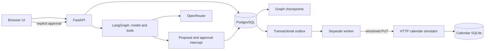

# Architecture and failure boundaries

## Allocation and ownership

`bookings` uses a GiST exclusion constraint on room ID and a half-open timestamp
range, restricted to confirmed records. Cancelling changes status; rescheduling
updates the same row. The constraint remains authoritative regardless of which
API process submits the request. Room capacity is also checked in the database.

Reservations are owned by opaque session IDs. Listing, lookup, edits, cancellation,
event histories, proposals, and reliability metrics are owner-scoped. Availability
and schedules disclose occupied time windows only, without titles or user IDs.

An idempotency request stores the original response in the same transaction as
creation. A per-owner/key advisory lock serializes duplicates. Matching retries
return that original response even if the booking later changes; clients should
GET the booking for current state. Different payloads with the same key fail.

Edits and cancellation use `If-Match: <version>`. Edits increment the version;
repeated cancellation returns the existing cancellation. There is no reactivation:
rebooking creates a new identity.

## Approval boundary

The model cannot call the approval endpoint as a tool. It can only ask the backend
to persist a proposal. The approval request contains the proposal ID, not new
arguments, so the client cannot swap the room or time while approving. The owner
session row is locked during chat and approval to serialize edits to pending
intent. Approval locks the proposal, checks owner/state/expiry, and creates the
booking in the same transaction as storing the result.

A chat turn holds its session transaction while waiting for the model. This is
simple and keeps proposal invalidation ordered, but ties up one database
connection per active turn. A larger deployment should use a durable conversation
revision/lease rather than holding a transaction across model requests.

## Outbox and remote effects

The booking trigger enqueues exactly one outbox row per `(booking_id, version)`.
A worker claims an available row under `FOR UPDATE SKIP LOCKED`, records a unique
lease token, increments attempts, and commits before making HTTP calls. The remote
call has a five-second timeout; the lease is thirty seconds.

The worker marks completion only if it still owns that lease. Updates to the
booking's calendar status also require the same booking version, so an old worker
cannot mark a newer edit synchronized. Obsolete jobs are marked superseded.

The simulator uses one persistent row per booking ID, with conditional version
updates. A stale write cannot resurrect a cancelled event. Cancellation is a
versioned tombstone, not physical deletion. Repeated identical writes return the
existing event; same-version/different-payload writes fail. These are simulator
protocol guarantees, not assumptions that every calendar provider satisfies.

| Failure point | Behavior |
| --- | --- |
| Allocation transaction rolls back | Neither booking nor outbox entry commits |
| API response is lost | Same idempotency key replays the original response |
| Worker dies before remote request | Lease expires and another worker reclaims it |
| Remote commits but response is lost | Retry reconciles the same ID/version |
| Worker dies after remote success | Expired lease is reclaimed; remote write is idempotent |
| Worker dies after local acknowledgment | Durable completed state remains complete |
| Six attempts fail | Room remains allocated; explicit review task appears |
| Booking changes during synchronization | New version queues work; stale acknowledgments cannot complete it |

The system promises eventual convergence under a reachable, contract-compliant
adapter. It does not promise exactly-once delivery, infinite automatic retries,
or immediate consistency between the room database and calendar.

## Metrics

The dashboard queries stored rows for the current session. Counts include the
current state of bookings, including calendar state of cancelled reservations.
A retried job is an outbox row with `attempts > 1`; manual retry resets the attempt
budget, while the immutable event history retains previous attempts.

Synchronization p95 is PostgreSQL's continuous percentile of elapsed seconds
from enqueue to completion for jobs in `done`. It includes waiting and retry
backoff. Unresolved and superseded jobs are excluded from this latency distribution,
so pending/review counts must be read alongside it. A null percentile displays
an em dash, never a fabricated zero. The worker heartbeat is fresh for 15 seconds;
it is a liveness signal, not proof of successful synchronization.

## Storage and operations

SQL migrations run transactionally under an advisory lock and are recorded in
`schema_migrations`. Apply them before starting the API/worker. Compose handles
this with a one-shot migration service. No database migration runs on an ordinary
HTTP request.

`/health` checks process liveness. `/ready` checks database access, the outbox, graph checkpoints, and proposal
workflow columns. The worker keeps pending work durable through process failure; PostgreSQL
backup/recovery remains an operational responsibility.

## LangGraph migration

The assistant graph defines model/tool routing, a human-approval interrupt, and a
reservation node. The PostgreSQL checkpoint adapter owns its schema; `app.db`
initializes it after application migrations using a separate autocommit connection.
Migration 004 invalidates legacy pending proposals because they have no graph
checkpoint. Existing bookings and completed proposals are retained.

### Request and checkpoint boundaries

Each chat turn has its own server-generated workflow ID. Conversation messages
provide context across turns; a new instruction supersedes pending proposals.
The graph routes `model -> tools -> model` with a three-call model budget, or
`tools -> approval (interrupt) -> reserve`. A clarification ends the current turn;
the next turn reuses the saved conversation. OpenRouter remains the model provider.

`PostgresSaver` uses the same psycopg connection/transaction as proposal and booking
writes. Synchronous checkpoint writes therefore commit with the API request. A
completed approval pause survives restart; an interrupted, uncommitted chat turn
rolls back and must be retried. This implementation does not claim mid-model-call
recovery. No keys or browser cookies are stored in graph state.

Approval accepts only a proposal ID. The server checks ownership, state, expiry,
and the paused node before issuing `Command(resume=...)`. The reservation node
rechecks the proposal. Booking, outbox, proposal result, and resumed checkpoint
commit together. Duplicate approval returns the stored result. A conflict rolls
back only the allocation savepoint, persists a conflict outcome, and returns
currently available alternatives. Choosing an alternative creates a fresh proposal
for the same time/group size; it never books silently.

`GET /assistant/workflow` exposes only the current owner's status, step trace,
and alternatives. Dismiss/reset revoke authority in the proposal table even if an
old checkpoint still exists. Checkpoint history is retained locally; reset hides
the conversation and revokes proposals, but is not a data-erasure operation.

### Scripted demonstrations

`POST /assistant/demo` prepares a fictional study-room proposal and executes the
same graph approval/reservation nodes without calling a model. The conflict fixture
creates a competing booking owned by a synthetic session. These local-only product
scenarios intentionally write demo data and are not production administrative APIs.
